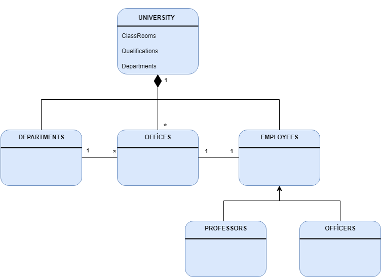

# Universite Yonetim Sistemi

1 - Üniversiteye ait sınıflıklar, çalışma ofisleri ve departmanlar vardır.

2 - Departmanlara ait ofisler vardır.

3 - Üniversiteye ait çalışanlar vardır. Bu çalışanlar profesör veya memur olabilir.

4 - Her çalışan bir ofiste çalışır.

**Aciklama: **
1 - Universite Sinifi;
Nitelikler: "siniflar", "ofisler", "departmanlar"
Iliskiler: Siniflar (Bir universite birden fazla sinifa ait olabilir.), CalismaOfisleri (Bir universitenin birden fazla calisma ofisi olabilir.), Departmanlar (Bir universitenin birden fazla departmani olabbilir.)

2 - Departman Sinifi;
Iliskiler: Bu sinifin icinde belirtilen diger siniflarla olan iliskiler; Ofisler (Bir departmanin birden fazla ofisi olabilir.)

3 - Calisan Sinifi;
Alt Siniflar: "Profesörler", "Memurlar"
Iliskiler: Bu sinifin icinde belirtilen diger siniflarla olan iliskiler; Ofisler (Her calisanin bir ofisi olmalidir.)

4 - Profesor ve Memur Sinifi;
Iliskiler: Bu sinifin icinde belirtilen diger siniflarla olan iliskiler; Ofisler (Her profesörün ve memurun bir ofisi olmalidir.)

5 - Ofis Sinifi;
Iliskiler: Bu sinifin icinde belirtilen diger siniflarla olan iliskiler; Calisanlar (Bir ofiste en az bir calisan olmalidir.)
